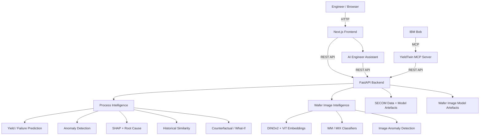

# Architecture

## System Architecture

## Components

| Component | Technology | Responsibility |
|---|---|---|
| Frontend | Next.js, React, TypeScript, Tailwind CSS | Dashboard, investigation, what-if, image analysis and AI Engineer Assistant |
| Backend API | Python, FastAPI, Uvicorn, Pydantic | API routing, validation, orchestration and ML inference |
| Process AI / ML | LightGBM, scikit-learn, SHAP, Isolation Forest | Failure-risk prediction, anomaly detection, explainability and root-cause analysis |
| Wafer Image AI | PyTorch, timm, DINOv2, ViT, OpenCV, NumPy | Wafer embedding, classification and image anomaly detection |
| AI Engineer Assistant | Next.js + YieldTwin REST APIs | Natural-language engineering investigation using live model results |
| IBM Bob Integration | IBM Bob + MCP | Invokes live YieldTwin prediction, anomaly, root-cause, feature-importance and what-if tools |
| Data / Model Storage | SECOM data, Joblib, PyTorch and configuration artefacts | Input data, preprocessing references, trained models and image-model artefacts |
| Database | None / file-based prototype | Current hackathon version uses local data and model artefacts; no external database is required |
| Notifications | None | No external notification service is used in the current prototype |

## Data Flow

1. The engineer provides a SECOM sample, process features, or a wafer image through the frontend.
2. Next.js sends the request to the FastAPI backend.
3. Process models calculate failure risk, anomaly information and root-cause evidence.
4. Wafer image models generate embeddings, classification results and image anomaly results.
5. The counterfactual engine evaluates alternative sensor values when a what-if scenario is requested.
6. The backend returns structured results to the dashboard or AI Engineer Assistant.
7. IBM Bob can invoke the same live backend capabilities through the YieldTwin MCP server.

## Security Considerations

- Environment files and secrets are excluded from Git.
- API configuration is environment/config based.
- No API keys or private credentials are committed to the repository.
- CORS is configurable through backend configuration.
- The current prototype does not implement authentication or role-based API authorization.
- Root-cause outputs are model/statistical hypotheses, not proven physical causes.
- Counterfactual and recommendation outputs require engineering validation.
- The system does not directly control semiconductor manufacturing equipment.

## Scalability Notes

The FastAPI layer is stateless and can be horizontally scaled behind a load balancer. Process and image inference can be separated and scaled independently. DINOv2/ViT image inference may benefit from higher-memory or GPU-backed infrastructure. File-based model artefacts can later be moved to object storage and persistent databases can be introduced for historical cases, audit logs and production-scale data.
